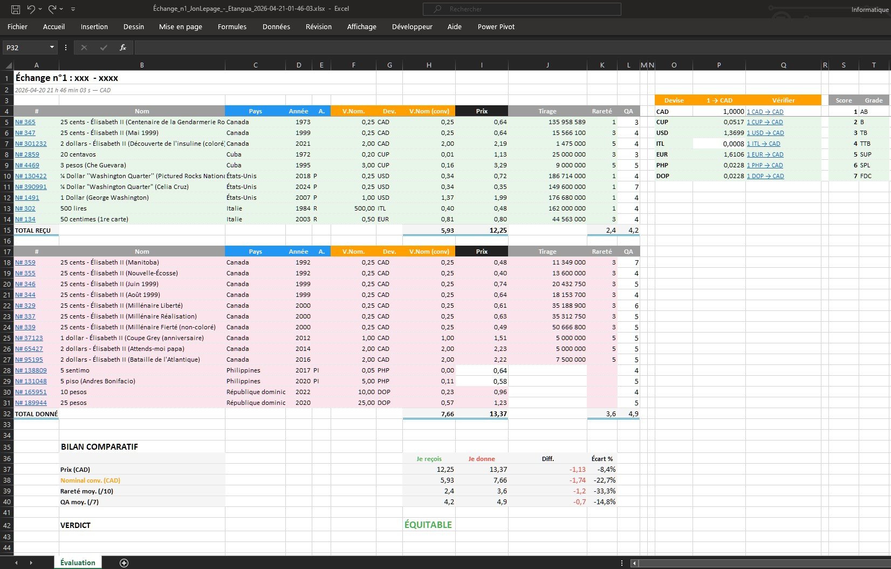
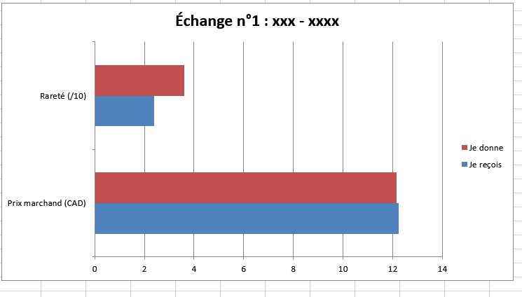

# numista-eval

Outil de télémétrie et de statistiques pour évaluer l'équité d'un échange de pièces sur [Numista](https://www.numista.com).

**🇬🇧 [English version](README.md)**

<a href="pre1.jpg"></a> <a href="prev2.jpg"></a>

## Pourquoi cet outil

Lors d'un échange entre collègues collectionneurs, il est souvent difficile de savoir si la transaction est équilibrée. `numista-eval` offre un **recul statistique** en croisant les prix marchands, les valeurs nominales, la rareté et la qualité de chaque pièce.

Les résultats ne sont pas à prendre à la lettre — Numista ne dispose pas toujours de toutes les métadonnées, ce qui peut altérer certaines estimations. C'est pourquoi le fichier Excel généré est **entièrement éditable** : il est possible d'ajuster les prix, les grades et les taux de conversion selon votre propre appréciation si elle est manquante ou altérée. Le fichier peut également être partagé avec votre partenaire d'échange pour en discuter et procéder à plusieurs itérations, jusqu'à trouver un équilibre qui satisfait les deux parties.

## Ce que ça produit

- Le **prix estimé** de chaque pièce (en CAD, EUR ou autre devise)
- Un **score de rareté** basé sur le tirage
- Un **bilan comparatif** avec verdict : ÉQUITABLE, ACCEPTABLE ou DÉSÉQUILIBRÉ
- Un **fichier Excel** avec formules dynamiques, modifiable pour affiner votre évaluation
- Un **graphique** de comparaison visuelle

## Prérequis

- [Node.js](https://nodejs.org) version 20 ou plus récent
- Une **clé API Numista** (gratuite) → [Obtenir votre clé](https://en.numista.com/api/doc.php)

> **Comment obtenir la clé :** se connecter sur Numista → Mon compte → API → Créer une application. Vous recevrez une clé (une longue chaîne de lettres et chiffres).

## Utilisation

### La commande

```bash
npx numista-eval "chemin/vers/fichier.xls" VOTRE_CLE_API
```

Le rapport s'affiche dans le terminal et un fichier Excel est généré dans le dossier `reports/`.

### Comment obtenir le fichier d'échange

1. Se rendre sur la page de votre échange sur Numista (exemple : `https://fr.numista.com/echanges/echange.php?id=926052`)
2. Cliquer sur **Exporter** (bouton en haut de la page d'échange)
3. Enregistrer le fichier `.xls` sur votre ordinateur

### Exemples

```bash
# Évaluation en dollars canadiens (par défaut)
npx numista-eval "echange_bob_alice.xls" abc123def456...

# Évaluation en euros
npx numista-eval "echange_bob_alice.xls" abc123def456... EUR

# Si votre clé est définie dans un fichier .env
npx numista-eval "echange_bob_alice.xls"
```

### Devises supportées

CAD (défaut), EUR, USD, GBP, et toute devise [ISO 4217](https://fr.wikipedia.org/wiki/ISO_4217). Les prix sont calculés par Numista dans la devise choisie.

## Le fichier Excel

Le rapport Excel contient :

**Onglet « Évaluation »** — Le tableau principal :

| Colonne      | Contenu                                              |
| ------------ | ---------------------------------------------------- |
| #            | Numéro Numista (lien cliquable vers la fiche)        |
| Nom          | Nom de la pièce                                      |
| Pays         | Pays émetteur                                        |
| Année        | Année de frappe                                      |
| A.           | Lettre d'atelier                                     |
| V.Nom.       | Valeur faciale (nominale)                            |
| Dev.         | Code devise de la pièce                              |
| V.Nom (conv) | Valeur nominale convertie dans votre devise          |
| Prix         | Prix estimé par Numista (grade VF)                   |
| Tirage       | Nombre d'exemplaires produits                        |
| Rareté       | Score de rareté (1 = très commun, 9 = rare)          |
| QA           | Qualité — à remplir selon votre appréciation (1 à 7) |

**À droite** — Un tableau de conversion des devises avec des liens Google pour vérifier les taux, ainsi qu'un tableau de référence des grades de qualité.

**En bas** — Le bilan comparatif : prix, valeur nominale, rareté et qualité moyennes avec les écarts en pourcentage.

### Qualité (QA)

La colonne QA propose un menu déroulant de 1 à 7. Il revient à chaque utilisateur d'évaluer l'état de conservation de ses pièces :

| Score | FR  | EN  | Description                     |
| ----- | --- | --- | ------------------------------- |
| 1     | AB  | AG  | Très usée, à peine identifiable |
| 2     | B   | G   | Usée mais identifiable          |
| 3     | TB  | F   | Usure visible, détails clairs   |
| 4     | TTB | VF  | Légère usure, belle apparence   |
| 5     | SUP | XF  | Usure minimale                  |
| 6     | SPL | AU  | Quasi neuve                     |
| 7     | FDC | UNC | Parfaite, jamais circulée       |

> Le prix affiché est basé sur le grade VF (TTB = score 4). Si les pièces sont en meilleur ou moins bon état, le prix réel peut varier.

**Onglet « Graphique »** — Un graphique comparant visuellement les deux côtés de l'échange.

## Conseils

- **Ne vous fiez pas uniquement au prix.** Les estimations de Numista sont basées sur les évaluations des membres, dont beaucoup sont des commerçants. Ces prix reflètent une valeur marchande souvent exagérée et ne tiennent pas compte de la valeur sentimentale ou de l'intérêt personnel que peut représenter une pièce. Pour certains, la numismatique est un commerce ; pour d'autres, c'est une passion — les deux perspectives sont légitimes, mais elles n'accordent pas la même importance au prix.

- **Les pièces commémoratives méritent une attention particulière.** Même si leur prix estimé est similaire à celui d'une pièce courante, elles sont généralement beaucoup plus rares à obtenir — on en trouve typiquement 0 à 5 dans un rouleau de 50 pièces. Cette rareté pratique n'est pas toujours reflétée dans le prix. Il est recommandé d'ajuster manuellement la colonne QA ou le prix pour ces pièces.

- **Vérifiez les taux de conversion.** Certaines devises retournées par l'API peuvent sembler inhabituelles (devises historiques, monnaies locales). Le tableau de conversion dans le fichier Excel fournit un lien cliquable pour chaque devise, permettant de vérifier le taux actuel sur Google et de confirmer l'état du marché.

## Quota API

Numista accorde **2 000 requêtes par mois** avec une clé gratuite. Chaque évaluation consomme environ **60 requêtes** (3 par pièce), ce qui permet d'évaluer environ 30 échanges par mois.

## Licence

MIT
