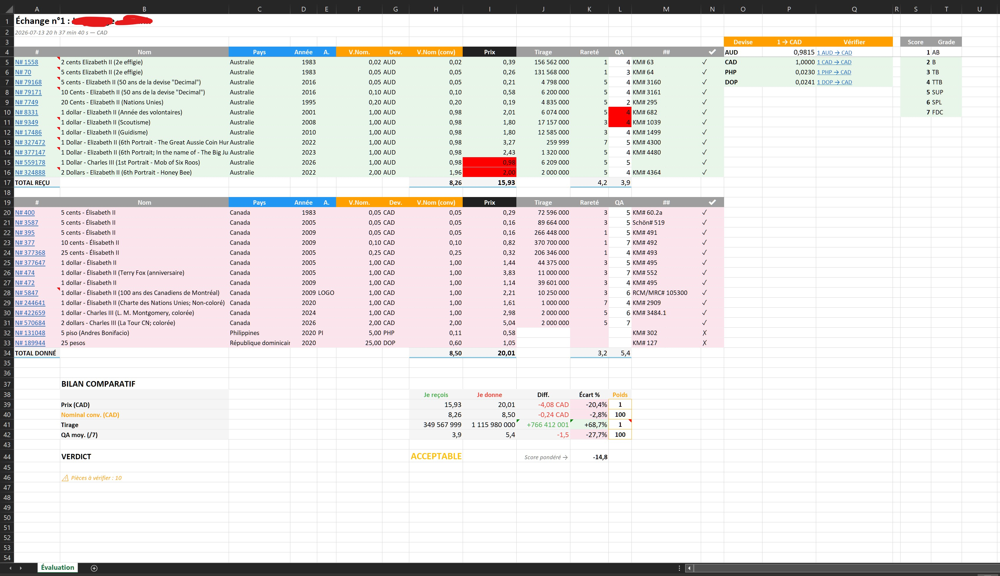

# numista-eval

Evaluate the fairness of a coin swap on [Numista](https://www.numista.com).

**🇫🇷 [Version française](README.fr.md)**

## What it does

You export a swap file from Numista, run the tool, and get an **Excel report** with estimated prices, rarity scores and a fairness verdict. The report is fully editable — adjust grades, exclude coins, share it with your swap partner.

[](./pre1.jpg)

## Setup

1. Install [Node.js](https://nodejs.org) (version 20+)
2. Get a free Numista API key → [numista.com/api](https://en.numista.com/api/index.php)

## How to use

**Step 1** — Export your swap from Numista:

- Open your swap page (e.g. `https://en.numista.com/echanges/echange.php?id=926052`)
- Click **Export** → save the `.xls` file

**Step 2** — Open a terminal and run:

```bash
npx numista-eval "C:\Users\me\Downloads\swap_file.xls" YOUR_API_KEY CAD --lang fr
```

**Step 3** — Open the Excel file from the `reports/` folder created next to your XLS.

### Examples

```bash
# French report in Canadian dollars
npx numista-eval "C:\Users\me\Downloads\swap_file.xls" YOUR_API_KEY CAD --lang fr

# English report in US dollars
npx numista-eval "C:\Users\me\Downloads\swap_file.xls" YOUR_API_KEY USD --lang en

# German report in euros
npx numista-eval "C:\Users\me\Downloads\swap_file.xls" YOUR_API_KEY EUR --lang de

# Chinese report in yuan
npx numista-eval "C:\Users\me\Downloads\swap_file.xls" YOUR_API_KEY CNY --lang zh

# Spanish report in Mexican pesos
npx numista-eval "C:\Users\me\Downloads\swap_file.xls" YOUR_API_KEY MXN --lang es
```

**Languages** ([ISO 639-1](https://en.wikipedia.org/wiki/List_of_ISO_639-1_codes))**:** `fr` `en` `de` `es` `pt` `it` `nl` `el` `ru` `zh` `ja`

**Currencies:** any [ISO 4217](https://en.wikipedia.org/wiki/ISO_4217) code — CAD, EUR, USD, GBP, CNY, JPY…

> **Tip:** create a `.env` file with `NUMISTA_API_KEY=YOUR_API_KEY` to avoid typing your key each time. On Windows, see `evaluate.example.bat` for a ready-to-use template.

## The Excel report

- **Price** adjusts automatically when you change the **QA** grade (1–7 dropdown)
- **✔ column** lets you include (✓) or exclude (✗) each coin — totals recalculate instantly
- Default ✓/✗ values are read from the Numista exchange file (your proposals vs. theirs)
- **Conversion rates** are fetched live and shown with Google verification links
- **Verdict** at the bottom: FAIR, ACCEPTABLE or UNBALANCED (colored)

## How the verdict is computed

The verdict is **not based on price alone**. Market price isn't always available on Numista, and it is sometimes inflated. The tool therefore combines **four indicators** into a single **weighted fairness score**:

| Indicator              | Default weight | Meaning                                            |
| ---------------------- | -------------- | -------------------------------------------------- |
| Estimated price        | 3              | the more value I receive, the better               |
| Face value (converted) | 1              | same                                               |
| Mintage                | 3              | **inverted**: lower mintage = rarer = in my favour |
| Quality (QA, /7)       | 3              | a higher grade received is better                  |

Each indicator is compared between the two sides as a **percentage gap**, then weighted. Only indicators that are actually quantified count: if the "given" value is empty or zero, the indicator is dropped and the score is **renormalized** over what remains.

> The weights are **editable directly in the Excel** file (_Weight_ column of the summary): the score and verdict recompute live.

### The formula (for the math-inclined)

For each present indicator _i_, compute the signed percentage gap between the two sides:

```
gᵢ = (received_i − given_i) / given_i × 100
```

The fairness score **S** is the weighted average of these gaps, renormalized over the present indicators only:

```
        Σ  wᵢ · sᵢ · gᵢ
S  =  ──────────────────
            Σ  wᵢ
```

- `wᵢ` = indicator weight (3, 1, 3, 3 by default)
- `sᵢ` = indicator sign: **+1** for price, face value and quality; **−1** for mintage (lower mintage favours the receiver)
- the sums run only over indicators whose "given" side is a **strictly positive** number

Sign convention: **S > 0 → the swap leans in my favour** (I receive more than I give); **S < 0 → against me**.

The verdict then applies thresholds on the **absolute value** of the score:

| Condition                 | Verdict           |
| ------------------------- | ----------------- |
| `abs(S) ≤ 8`              | **FAIR**          |
| `8 < abs(S) ≤ 20`         | **ACCEPTABLE**    |
| `abs(S) > 20`             | **UNBALANCED**    |
| no quantifiable indicator | **INDETERMINATE** |

### Worked example

Assume a swap where QA is left blank (so the quality indicator is excluded and the denominator drops to `3 + 1 + 3 = 7`):

| Indicator  | Received | Given  | Gap `gᵢ` | Sign `sᵢ` |
| ---------- | -------- | ------ | -------- | --------- |
| Price      | 0.96     | 0.28   | +248.5 % | +1        |
| Face value | 0.06     | 0.04   | +45.9 %  | +1        |
| Mintage    | 2.44 G   | 2.48 G | −1.4 %   | −1        |

```
      3·(+248.5) + 1·(+45.9) + 3·(−1)·(−1.4)
S  =  ───────────────────────────────────────  =  795.6 / 7  ≈  +113.7
                    3 + 1 + 3
```

`abs(113.7) > 20` → **UNBALANCED**: I receive about 3.4× more value than I give (estimated at the lowest grade). The terminal and the Excel share **exactly the same formula** ([src/fairness.ts](src/fairness.ts)) — so they always display the same verdict.

> **About the Mintage row in the summary:** it is shown from the **favourability angle** — receiving _more_ mintage (more common coins) is unfavourable, so the gap shows as negative/red. This keeps "green = in my favour" true for **every** row. It is exactly the `−1` sign of mintage in the formula above: the verdict is identical.

## Limitations

- **Grades (QA) are approximate.** Numista does not provide coin condition in swap files, so the **QA column is left blank**. While it stays blank, the estimated price falls back to the **lowest known grade**. Pick a QA value (1–7) per coin to refine the price based on its actual condition — this directly affects the verdict.
- **Not all languages are fully supported.** The Excel report is available in 11 languages (see list above). If an unsupported language code is provided, the report falls back to English.

## Tips

- **Prices are estimates.** They reflect dealer market value, not collector or sentimental value.
- **Commemorative coins** are usually harder to find than their price suggests — adjust accordingly.
- **Check conversion rates** for unusual currencies using the links in the Excel file.

## One-click evaluation (Windows)

To avoid repeating the full command, create a reusable batch file with your settings.

1. Create a new text file and rename it to `evaluate.bat`
2. Copy the contents of [`evaluate.example.bat`](evaluate.example.bat) into it
3. Replace the three values with your own: API key, currency, language
4. Save — you're done. From now on, just double-click `evaluate.bat`

```bat
@echo off
set API_KEY=YOUR_API_KEY_HERE
set CURRENCY=CAD
set LANG=fr

set /p FILE=Path to XLS file:
set FILE=%FILE:"=%
call npx numista-eval@latest "%FILE%" %API_KEY% %CURRENCY% --lang %LANG%
pause
```

> **How to copy a file path on Windows:** hold `Shift` and right-click the XLS file to reveal the hidden menu, then select **Copy as path**.
>
> This is optional — the `npx` command in the terminal works exactly the same way.

## API quota

2,000 requests/month (free key). Each evaluation ≈ 60 requests → ~30 evaluations/month.

## License

MIT
